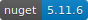
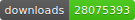
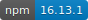
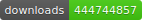

# SVG Badges generator

An SVG badge generator developed as part of a self-training about Node.js and testing/mocking with Jasmine. It returns info badges about about Npm and Nuget packages.

## Available API

### Nuget

*/nuget/version/{package}*

Returns an SVG with the Nuget package's latest version. Example:

`/nuget/version/unity`

*/nuget/downloads/{package}*

Returns an SVG with the Nuget package's total downloads. Example:

`/nuget/downloads/unity`

### Npm

*/npm/version/{package}*

Returns an SVG with the Npm package's latest version. Example:

`/npm/version/react`

*/npm/downloads/{package}*

Returns an SVG with the Npm package's total downloads. Example:

`/npm/downloads/react`

### Static

*/static/{left}-{right}-{color}*

Returns a custom badge with the provided messages and color. Examples

`/static/Hi-there-YellowGreen`

List of Supported colors:

- Blue
- Green
- BrightGreen
- YellowGreen
- Yellow
- Orange
- Red
- LightGrey

## License

Apache License V2
